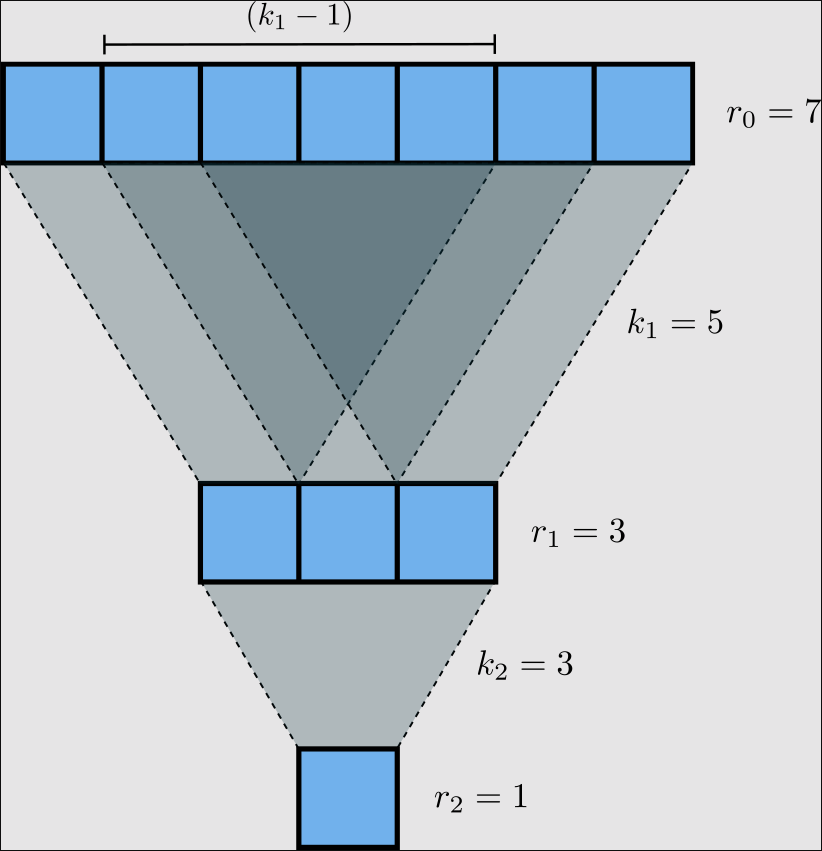

# Editorial for Intra-IUT Junior Programming Contest 2025

<details>
<summary>Problem A - Arcane Accumulation</summary>

Problem Setter: [Jannatul Fardus Rakhi](https://codeforces.com/profile/sectumsemprra)

Difficulty: Medium-Hard

Tag(s): Greedy

<details>
<summary> Hint 1</summary>

You only need the final total magical potential, not the entire lineup of wizards.

</details>

<details>
<summary> Hint 2</summary>

Focus on the effect of the spell, not the entire cloning process.

</details>

<details>
<summary> Hint 3</summary>

What would be the optimal strategy for $k = 1$?

</details>

<details>
<summary> Hint 4</summary>

Only the original wizards' clones survive. Since clones of clones do not survive, it's easier to think of them as not being created in the first place.

</details>

<details>
<summary> Hint 5</summary>

Even though a cloned wizard can cast the spell, the effect of a clone casting the spell is identical to the first original wizard to his right casting it. So it's easier to not consider clones among candidates who can cast the spell.

</details>

<details>
<summary>Solution</summary>

Let's begin by understanding what happens when the **Cloning Spell** is used **once**.

When the _i-th_ wizard casts the spell:

- All _original_ wizards from position $1$ to $(i - 1)$ are cloned.
- These clones are inserted immediately before wizard $i$.
- The rest shift right accordingly.
- The overall effect of the spell is that a **segment** (prefix) of original wizards are cloned and added to the lineup.
- The cloned segment adds $(a_1 + \dots + a_{i - 1})$ to the total magical potential. This is exactly the **prefix sum** of the array up to index $(i - 1)$, i.e., $prefixSum[i - 1]$.

---

Imagine you're allowed to **cast the spell only once**. To get the **maximum benefit**, you'd want to clone the segment of wizards with the **largest possible prefix sum**.

So:

- Consider $prefixSum[0] = 0$.
- For every $i$ from $1$ to $n$, compute $prefixSum[i] = \sum_{j=1}^{i} (a_j) = prefixSum[i - 1] + a_i$.
- Try every $i$ from $1$ to $n$, and choose the maximum value $prefixSum[i - 1]$.
- This value is the **gain** from one spell. Add it to $prefixSum[n]$ to get the final magical potential.
- Notice that you cannot get $prefixSum[n]$ as gain because nobody can make a clone of the last wizard.

---

Now what happens when you can cast the spell **up to $k$ times**?

Here's the key insight:

- Clones **can't be cloned** again.
- Whenever a spell is cast, the new wizards added to the lineup (and survive) will always be a **segment** (prefix) of the original wizard lineup.

Thus:

- The **gain from each additional spell** is **fixed** once you pick the best wizard $i$.
- So if you pick the best $i$, you can gain $prefixSum[i - 1]$ from each of the $k$ spells.

---

Final Formula:

- Let
  $\text{initialSum} = \sum_{i = 1}^{n } (a_i) = prefixSum[n]$

- Let
  $\text{maxPrefixSum} = \max(\text{prefixSum}[0], \text{prefixSum}[1], \dots, \text{prefixSum}[n - 1])$

Then, the total magical potential after applying the cloning spell up to $k$ times is given by:

$\large\text{answer} = \text{initialSum} + k \times \text{maxPrefixSum}$

Time Complexity = $O(n)$

**P.S.: The witches won the fight because all wizards must die.**

# Code

```cpp
#include <bits/stdc++.h>
using namespace std;
#define ll long long

int main() {
   ios::sync_with_stdio(0);
   cin.tie(0);

   ll t = 1;
   cin >> t;

   while (t--) {
       ll n, k;
       cin >> n >> k;

       vector<ll> wizards(n+1);
       for (ll i = 1; i <= n; i++) {
           cin >> wizards[i];
       }

       vector<ll> prefixSum(n+1);
       prefixSum[0] = 0;
       for (ll i = 1; i <= n; i++) {
           prefixSum[i] = prefixSum[i - 1] + wizards[i];
       }

       ll initialSum = prefixSum[n], maxPrefixSum = 0;
       for (ll i = 1; i <= n - 1; i++) {
           maxPrefixSum = max(maxPrefixSum, prefixSum[i]);
       }

       ll answer = initialSum + k * maxPrefixSum;
       cout << answer << '\n';
   }

   return 0;
}
```

</details>
</details>
</details>

<details>
<summary>Problem B - Balloon</summary>

Problem Setter: [Reaz Hassan Joarder](https://codeforces.com/profile/ssshanto)

Difficulty: Giveaway

<details>
<summary>Hint</summary>

This problem has no input.

</details>

<details>
<summary>Solution</summary>

You can implement the decryption algorithm. But since the answer is fixed, it is easier to decrypt it by yourself using a pen and paper. Then, simply print the decrypted string.

---

Let's go through this _tough_ problem step-by-step. The encrypted string that you are given is `"NILE LE A BAMVOOG"`. Keeping the spaces and vowels in their original positions, and masking out the consonants yields a skeleton of the form `_I_E _E A _A__OO_`.  
Here, the original sequence of the filtered consonants is `[N, L, L, B, M, V, G]`, which upon being reversed, as per the encryption scheme, becomes `[G, V, M, B, L, L, N]`. Now, fill in the blank boxes of the skeleton string with the consonants in the order that they appear in the inverted sequence, and—voilà!—you obtain the answer `"GIVE ME A BALLOON"`.

<details>
<summary>Code</summary>

```cpp
#include <bits/stdc++.h>
using namespace std;

int main()
{
    cout << "GIVE ME A BALLOON";
}
```

</details>

<details>
<summary>Code</summary>

```cpp
#include <bits/stdc++.h>
using namespace std;

#define fastio ios_base::sync_with_stdio(0); cin.tie(0)
using LL = long long;

bool isVowel(char ch)
{
    return ch == 'A' || ch == 'E' || ch == 'I' || ch == 'O' || ch == 'U';
}

void pre()
{
    fastio;
}

void solve(int tc)
{
    string str = "NILE LE A BAMVOOG";
    string consonants;

    int i, j, n = str.size();
    char ch;

    for(i = 0; i < n; i++)
    {
        ch = str[i];

        if(!isVowel(ch) && ch != ' ')
        {
            str[i] = '_';
            consonants += ch;
        }
    }

    reverse(consonants.begin(), consonants.end());

    // Check out the masked string and reversed consonants
    // cout << str << '\n' << consonants << '\n';

    j = 0;
    for(i = 0; i < n; i++)
    {
        ch = str[i];

        if(ch == '_')
        {
            str[i] = consonants[j];
            ++j;
        }
    }

    cout << str;
}

signed main()
{
    pre();

    int tc, tt = 1;
    //cin >> tt;

    for(tc = 1; tc <= tt; tc++)
    {
        solve(tc);
        cout << '\n';
    }

    return 0;
}
```

</details>
</details>
</details>

<details>
<summary>Problem C - You Can't See Me</summary>

Problem Setter: [Sabbir Ahmed](https://cse.iutoic-dhaka.edu/profile/sabbir/)

Difficulty: Easy

Tag(s): Math

<details>
<summary>Hint 1</summary>

What happens with a single convolution layer?  
If you apply a kernel of size $k$ to an image, how many input pixels does a single output pixel depend on?

</details>

<details>
<summary>Hint 2</summary>

How does the receptive field grow with each layer?  
If you stack two convolution layers, each with kernel size $k_1$ and $k_2$, how does the receptive field of the output pixel relate to the previous layer?

</details>

<details>
<summary>Hint 3</summary>

Can you find a pattern or a recurrence relationship?

</details>

<details>
<summary>Solution</summary>

The **Manhattan distance** between two points $(x_1, y_1)$ and $(x_2, y_2)$ is defined as $|x_1 - x_2| + |y_1 - y_2|$.

For a square kernel of size $k_i \times k_i$, the top-left and bottom-right corners are $(0, 0)$ and $(k_i - 1, k_i - 1)$, so the Manhattan distance between them is $2(k_i - 1)$. This is how far apart two corners of the receptive field become after one layer.

If you apply $n$ layers with kernel sizes $k_1, k_2, \dots, k_n$, the total Manhattan distance from the top-left to bottom-right of the receptive field is $\sum_{i=1}^{n} 2(k_i - 1)$.

Now, suppose the final receptive field is a square of side length $L$. Its top-left and bottom-right corners are $(0, 0)$ and $(L - 1, L - 1)$, so their Manhattan distance is $2(L - 1)$.

Equating this with the total distance, we get $2(L - 1) = \sum_{i=1}^{n} 2(k_i - 1)$. Solving this equation gives: $\boxed{L = \sum_{i=1}^{n}(k_i - 1) + 1}$

This is the side length of the final receptive field.

<details>
<summary>Code</summary>

```cpp
#include <bits/stdc++.h>
using namespace std;

#define fastio ios_base::sync_with_stdio(0); cin.tie(0)

using LL = long long;


void pre()
{
    fastio;
}

void solve(int tc)
{
    int i, n;
    cin >> n;

    vector<int> k(n);
    for(auto &it: k) cin >> it;

    LL d = 0;
    for(i = 0; i < n; i++) d += k[i] - 1;

    cout << d + 1;
}

signed main()
{
    pre();

    int tc, tt = 1;
    cin >> tt;

    for(tc = 1; tc <= tt; tc++)
    {
        // cout << "Case " << tc << ": ";
        solve(tc);
        cout << endl;
    }

    return 0;
}
```

</details>
</details>

<details>
<summary>Hint 4</summary>
The kernels are square and so is the receptive field.
</details>

<details>
<summary>Hint 5</summary>
Think in 1D instead of 2D for easy understanding.
</details>

<details>
<summary>Alternate Solution</summary>

Our objective is to determine the size of the receptive field at the input layer (denoted as $r_0$). How should we approach this?

If we carefully examine the illustration given in the problem statement, we can observe a hierarchical or _"pyramidal"_ relationship between the receptive field sizes of successive layers. Specifically, each layer’s receptive field is built upon the receptive field of the previous layer, expanding outward as we move closer to the input. This pattern can be leveraged to express the receptive field at any layer in terms of the layers above it, ultimately leading us to a general formula for $r_0$.

To make the problem even more approachable, let's visualize our neural network as a sequence of 1-dimensional convolutional layers. This simplification is valid because convolutional kernels are usually symmetric across their dimensions. Even in cases with asymmetric kernels, the same reasoning can be applied independently to each dimension. With that in mind, let’s consider a straightforward 1D convolutional neural network:



Each layer’s receptive field builds on the previous layer, expanding outward. If we consider the receptive field size at layer $i$ as $r_i$, then we can express:  
$r_{i-1} = (k_i - 1) + r_i$

Since the output layer has a receptive field of $r_n = 1$, we can work backwards:

$r_{n-1} = r_n + (k_n - 1) = 1 + (k_n - 1) = k_n$\
$r_{n-2} = r_{n-1} + (k_{n-1} - 1) = k_n + k_{n-1} - 1$\
$r_{n-3} = r_{n-2} + (k_{n-2} - 1) = k_n + k_{n-1} + k_{n-2} - 2$\
$\vdots$\
$r_0 = \sum_{i=1}^n k_i - (n - 1) = \sum_{i=1}^n k_i - n + 1$

Thus, we obtain $r_0$, which is the receptive field at Layer 0.

<details>
<summary>Code</summary>

```cpp
#include <bits/stdc++.h>
using namespace std;

#define Godspeed                ios_base::sync_with_stdio(0);cin.tie(NULL)
#define urs(r...)               typename decay<decltype(r)>::type
#define REP(i,b)                for(urs(b) i=0;i<b;i++)
#define all(a)                  a.begin(),a.end()
#define Bye                     return 0
#define ll                      long long

int main()
{
    Godspeed;
    int Tests=1;
    cin>>Tests;
    while(Tests--)
    {
        ll n;
        cin>>n;
        vector<ll>k(n);
        REP(i,n)
        {
            cin>>k[i];
        }
        cout<<accumulate(all(k),0LL)-n+1<<endl;
    }
    Bye;
}
```

</details>
</details>
</details>

<details>
<summary>Problem D - Arise</summary>

Problem Setter: [Akib Haider](https://codeforces.com/profile/_akibhaider_)

Difficulty: Medium

Tag(s): Brute Force, Implementation, Strings, Data Structures

<details>
<summary>Hint 1</summary>

Read the input constraints carefully.

</details>

<details>
<summary>Hint 2</summary>

Have you heard of **brute force**? What will the time complexity of brute force approach here considering all queries and total word length?

</details>

<details>
<summary>Solution</summary>

This problem can be solved using a brute-force approach.

The main task is to check whether a given string (a soldier’s name) appears in a straight line in a 2D grid. Since the grid size is small (the total number of characters is at most 1000 across all test cases), it is efficient enough to simply check **every possible starting position** in the grid and try to match the string in **each of the 8 directions** (horizontal, vertical, and both diagonals).

For each name:

- Start at every position in the grid.
- For each direction from the 8 possible directions, try to match each character in the string.
- If the full string matches without going out of bounds, count it.

While the algorithm is simple, the code can become very large unless written in a clean way. The implementation can be made much cleaner and more manageable by using **functions**. Repeating the same block of code in multiple places is bad practice. Function improves readability, reduces the chance of errors, and makes debugging and testing easier.

**Overall Time Complexity :** $O(q × n × m × w)$

**Parameter Definitions**

| Parameter | Description                     |
| --------- | ------------------------------- |
| $q$       | Number of queries               |
| $n$       | Number of rows in the grid      |
| $m$       | Number of columns in the grid   |
| $w$       | Sum of characters to be queried |

<details>
<summary>Code</summary>

```cpp
#include <bits/stdc++.h>
using namespace std;

#define fastio ios_base::sync_with_stdio(0); cin.tie(0)
using LL = long long;

bool foundInLine(vector<string>& grid, string& str, int sx, int sy, int dx, int dy)
{
    int k, l = str.size(), n = grid.size(), m = grid[0].size();
    int x, y, kx, ky;

    for(k = 0; k < l; k++)
    {
        kx = k * dx;
        ky = k * dy;

        x = sx + kx;
        y = sy + ky;

        if(x < 0) return 0;
        if(y < 0) return 0;

        if(x >= n) return 0;
        if(y >= m) return 0;

        if(grid[x][y] != str[k]) return 0;
    }

    return 1;
}

bool foundInGrid(vector<string>& grid, string& str)
{
    int i, j, n = grid.size(), m = grid[0].size();

    for(i = 0; i < n; i++)
    {
        for(j = 0; j < m; j++)
        {
            if(foundInLine(grid, str, i, j, 1, 0)) return 1;
            if(foundInLine(grid, str, i, j, -1, 0)) return 1;
            if(foundInLine(grid, str, i, j, 0, 1)) return 1;
            if(foundInLine(grid, str, i, j, 0, -1)) return 1;
            if(foundInLine(grid, str, i, j, 1, 1)) return 1;
            if(foundInLine(grid, str, i, j, 1, -1)) return 1;
            if(foundInLine(grid, str, i, j, -1, 1)) return 1;
            if(foundInLine(grid, str, i, j, -1, -1)) return 1;
        }
    }
    return 0;
}

void pre()
{
    fastio;
}

void solve(int tc)
{
    int n, m;
    cin >> n >> m;

    vector<string> grid(n);
    for(auto &row: grid) cin >> row;

    int q, cnt = 0;
    string str;
    cin >> q;

    while(q--)
    {
        cin >> str;
        cnt += foundInGrid(grid, str);
    }
    cout << cnt;
}

int main()
{
    pre();

    int tc, tt = 1;
    cin >> tt;

    for(tc = 1; tc <= tt; tc++)
    {
        solve(tc);
        cout << '\n';
    }
    return 0;
}
```

</details>
</details>

<details>
<summary>Alternate Solution 1</summary>

Instead of manually scanning the grid in 8 directions for every string, you can flatten the grid into a single _text_ string that contains all the lines — rows, columns, diagonals — separated by delimiters (e.g., commas, underscores, or dollar signs) that are guaranteed not to occur in the grid.

Steps:

- Build one string that contains:
  - All rows (left-to-right)
  - All columns (top-to-bottom)
  - All diagonals (top-left to bottom-right and top-right to bottom-left)
- Reverse the entire string to handle all 8 directions.
- For each soldier name, check whether it appears as a substring in the flattened text.

<details>
<summary>Code</summary>

```cpp
#include <bits/stdc++.h>
using namespace std;

#define fastio ios_base::sync_with_stdio(0); cin.tie(0)
using LL = long long;

void gridToText(vector<string>& grid, string& text)
{
    int i, j, k, n = grid.size(), m = grid[0].size();
    char sep = ' ';

    // Left to Right
    for(i = 0; i < n; i++)
    {
        for(j = 0; j < m; j++)
        {
            text.push_back(grid[i][j]);
        }

        text.push_back(sep);
    }

    // Top to Bottom
    for(j = 0; j < m; j++)
    {
        for(i = 0; i < n; i++)
        {
            text.push_back(grid[i][j]);
        }

        text.push_back(sep);
    }

    // Top-Left to Bottom-Right
    for(i = 0; i < n; i++)
    {
        for(k = 0; i + k < n && k < m; k++)
        {
            text.push_back(grid[i + k][k]);
        }

        text.push_back(sep);
    }
    for(j = 1; j < m; j++)
    {
        for(k = 0; k < n && j + k < m; k++)
        {
            text.push_back(grid[k][j + k]);
        }

        text.push_back(sep);
    }

    // Bottom-Left to Top-Right
    for(i = 0; i < n; i++)
    {
        for(k = 0; i - k >= 0 && k < m; k++)
        {
            text.push_back(grid[i - k][k]);
        }

        text.push_back(sep);
    }
    for(j = 1; j < m; j++)
    {
        for(k = 0; k < n && j + k < m; k++)
        {
            text.push_back(grid[n - 1 - k][j + k]);
        }

        text.push_back(sep);
    }

    string rev = text;
    rev.pop_back(); // remove last sep
    reverse(rev.begin(), rev.end());
    text = text + rev;
}

bool foundInText(string& text, string& pattern)
{
    int i, j, n = text.size(), m = pattern.size();
    string window;

    for(i = 0; i < n; i++)
    {
        window = text.substr(i, m);
        if(window == pattern) return 1;
    }

    return 0;
}


void pre()
{
    fastio;
}

void solve(int tc)
{
    int n, m;
    cin >> n >> m;

    vector<string> grid(n);
    for(auto &row: grid) cin >> row;

    string text, soldier;
    gridToText(grid, text);

    // Check out how the text looks
    // cout << text << '\n';

    int i, q, cnt = 0;
    cin >> q;

    while(q--)
    {
        cin >> soldier;
        cnt += foundInText(text, soldier);
    }

    cout << cnt;
}

int main()
{
    pre();

    int tc, tt = 1;
    cin >> tt;

    for(tc = 1; tc <= tt; tc++)
    {
        solve(tc);
        cout << '\n';
    }

    return 0;
}
```

</details>
</details>
 
<details>
<summary>Alternate Solution 2</summary>
           
Let's consider a situation where soldier names to be queried are: "L", "Leo", "Leon", "Leonardo"! Notice that "L", "Leo", "Leon" are all prefixes of "Leonardo", thus forming a progressive sequence. In a naive brute-force approach, all common characters in a progressive sequence (such as the earlier case) are overcounted. Iterating over the characters in "Leonardo" is enough. To counter this situation, among many other approaches, one simpler solution is to store the words in a dictionary-like structure using a data structure called a "Prefix Tree" or "Trie".

The key idea is to iterate only over the longer word (Leonardo) and mark the end positions of other words (L at index 0, Leo at index 2, Leon at index 3). Then, one iteration over the characters in the longer word is sufficient—prefixes are searched on the fly!

This will reduce the worst case time complexity in a significant way

From $O(q * n * m * w)$ to $O(n * m * maxWordLength + s * avgWordLength)$ using **Trie**

[Go through this tutorial on Trie if you are interested](https://www.geeksforgeeks.org/introduction-to-trie-data-structure-and-algorithm-tutorials/) (Highly encouraged)

<details>
<summary>Code</summary>

```cpp
#include <bits/stdc++.h>
using namespace std;

#define fastio ios_base::sync_with_stdio(0); cin.tie(0)
using LL = long long;

const int dx[] = {1, -1, 0, 0, 1, 1, -1, -1};
const int dy[] = {0, 0, 1, -1, 1, -1, 1, -1};

struct TrieNode {
    unordered_map<char, TrieNode*> children;
    bool isEnd = false;
};

class Trie {
public:
    TrieNode* root;
    Trie() { root = new TrieNode(); }

    void insert(const string& word) {
        TrieNode* node = root;
        for (char c : word) {
            if (!node->children.count(c))
                node->children[c] = new TrieNode();
            node = node->children[c];
        }
        node->isEnd = true;
    }

    bool markFound(const string& word) {
        TrieNode* node = root;
        for (char c : word) {
            if (!node->children.count(c)) return false;
            node = node->children[c];
        }
        if (node->isEnd) {
            node->isEnd = false;  // mark as used
            return true;          // first time found
        }
        return false;             // already found before
    }
};

int n, m;
vector<string> grid;
Trie trie;
int ans;

void searchFrom(int x, int y, int dirX, int dirY) {
    TrieNode* node = trie.root;
    string word = "";

    for (int step = 0; step < 1000; ++step) {
        if (x < 0 || x >= n || y < 0 || y >= m) break;
        char c = grid[x][y];
        if (!node->children.count(c)) break;

        node = node->children[c];
        word += c;

        if (node->isEnd) {
            if (trie.markFound(word)) {
                ans++;
            }
        }

        x += dirX;
        y += dirY;
    }
}

void solve() {
    cin >> n >> m;
    grid.resize(n);
    for (auto& row : grid) cin >> row;

    int q;
    cin >> q;
    trie = Trie();
    ans = 0;

    string word;
    while(q--) {
        cin >> word;
        trie.insert(word);
    }

    for (int i = 0; i < n; ++i) {
        for (int j = 0; j < m; ++j) {
            for (int d = 0; d < 8; ++d) {
                searchFrom(i, j, dx[d], dy[d]);
            }
        }
    }

    cout << ans << '\n';
}

int main() {
    fastio;
    int t;
    cin >> t;
    while (t--) {
        solve();
    }
    return 0;
}
```

</details>
</details>

</details>

<details>
<summary>Problem E - Eid Salami</summary>

Problem Setter: [Irfanur Rahman Rafio](https://codeforces.com/profile/Rafio)

Difficulty: Hard

Tag(s): Greedy, Binary Search

<details>
<summary>Hint 1</summary>

First, focus on finding an optimal visiting order. Once you have that, calculating the minimum loan is easy.

</details>

<details>
<summary>Hint 2</summary>

Check out the sample test cases. For every cases, find the order of visiting houses and try to understand what is going on.

</details>

<details>
<summary>Hint 3</summary>

When a system has too many moving parts, you should first try to isolate their effects.  
For this problem, analyze special cases like:

- Zunaid has to give the same amount in every house.
- Zunaid will receive the same amount in every house.
- The delta (receive - give) is the same for all houses.

</details>

<details>
<summary>Hint 4</summary>

If Zunaid took loans whenever needed instead of a single large loan at the beginning, the total amount borrowed would remain the same.

</details>

<details>
<summary>Hint 5</summary>

It is always optimal to visit _delta-positive_ houses before _delta-negative_ houses.

</details>

<details>
<summary>Hint 6</summary>

What to do if all the houses are _delta-positive_ or all the houses are _delta-negative_?

</details>

<details>
<summary>Solution</summary>

At first, let's define some terms formally:

- For the $i$-th house, $\delta_i = r_i - g_i$
- A house is _delta-positive_ if $\delta_i > 0$
- A house is _delta-negative_ if $\delta_i < 0$

---

The first key insight is that there is _no reason whatsoever_ to visit a delta-negative house before a delta-positive one. Every house must be visited eventually. So, if Zunaid visits a delta-negative house early, he reduces his balance. This is never good.  
Visiting a delta-positive house afterward will still require him to give $g_i$ before receiving anything, which means the earlier balance reduction may force him to borrow more. The opposite order — visiting delta-positive houses first — helps increase the balance before visiting any other house.

So, all delta-positive houses should be visited before any delta-negative house.

---

Now, among the delta-positive houses, the goal is to make sure Zunaid can visit them with the smallest possible initial loan. Even though all these houses are profitable in the long run, Zunaid still has to give $g_i$ before he gets $r_i$. Therefore, among these, it makes sense to visit the houses that require the _least_ upfront money first. That way, Zunaid starts with visits that are cheap but profitable, which gradually builds up his balance. Then, when he reaches a house where he has to give a large $g_i$, his previous profit may already be enough to cover it, saving him from taking a large loan.

Hence, the delta-positive houses should be visited in _ascending_ order of $g_i$.

---

The ordering among delta-negative houses is less obvious. But it turns out that the way you order them can make a significant difference in how deep the balance goes below zero — and therefore how much Zunaid has to borrow.

Here are some observations:

- All delta-negative houses _must_ be visited eventually. None of them can be avoided and each will reduce the balance.
- If the receiving amount is the same for all delta-negative houses, the order doesn't matter.
- The money received from the _last_ house doesn't help at all.
- Similarly, the money received from the _second last_ house can only help in the last house.
- So, if there is a house from where Zunaid can receive a large amount of money, Zunaid should visit it early so that he can use that money. Even if Zunaid has to give a large amount to that house first, delaying it doesn't help at all. In fact, visiting other delta-negative houses will reduce his balance and make the situation worse.

Therefore, among delta-negative houses, it's best to visit first the ones where Zunaid receives more money. This gives him some balance to work with before facing the next loss.

So, delta-negative houses should be visited in _descending_ order of $r_i$.

---

Once the visiting order is fixed using the above rules, simulate the journey:

- Start with a balance of zero.
- At each house:
  - Subtract $g_i$ from the balance.
  - If the balance becomes negative, track how far below zero it goes — this represents how much loan Zunaid would have needed at the start.
  - Then add $r_i$ to the balance.
- The minimum required loan is the _maximum magnitude of the negative balance_ at any point during the simulation.

This method gives you the answer directly. Alternatively, you could design a function that checks whether a loan of $x$ is sufficient and binary search for the smallest such $x$.

---

**Summary of Strategy**:

1. Split the houses into delta-positive and delta-negative. Houses with $\delta_i = 0$ can be considered either delta-positive or delta-negative, but not both.
2. Sort:
   - Delta-positive houses by increasing $g_i$.
   - Delta-negative houses by decreasing $r_i$.
3. Visit all delta-positive houses first, then all delta-negative houses.
4. Simulate the journey and find the minimum required loan.

---

$\text{Time Complexity for sorting} = O(n \log(n))$  
$\text{Time Complexity for calculating loan directly} = O(n)$  
$\text{Overall Time Complexity} = O(n \log(n) + n) = O(n \log(n))$

With the binary search approach, the time complexity of the checking function is $O(n)$. The function needs to be called $O(\log(m))$ times where $m$ is the maximum possible loan. For the given constraints, it would be $2 \times 10^{14}$.  
$\text{Overall Time Complexity} = O(n \log(n) + n \log(m)) = O(n \log(m))$

<details>
<summary>Proof</summary>

The correctness of the strategy can be proven by proving three claims.

---

Before proving any of the claims, let's establish the premise of the argument.

Suppose there are two houses:

- $(g_1, r_1)$ with $\delta_1 = r_1 - g_1$
- $(g_2, r_2)$ with $\delta_2 = r_2 - g_2$

Two visiting orders can be considered.

_Option 1:_ Visit $(g_1, r_1)$ before $(g_2, r_2)$  
Balance timeline: $[x, x - g_1, x + \delta_1, x + \delta_1 - g_2, x + \delta_1 + \delta_2]$  
Minimum balance: $\min(x - g_1, x + \delta_1 - g_2)$

_Option 2:_ Visit $(g_2, r_2)$ before $(g_1, r_1)$  
Balance timeline: $[x, x - g_2, x + \delta_2, x + \delta_2 - g_1, x + \delta_1 + \delta_2]$  
Minimum balance: $\min(x - g_2, x + \delta_2 - g_1)$

**The optimal choice is the one that maximizes the minimum balance.**

---

_Claim 1: Delta-positive houses must be visited before delta-negative houses._

Assume $\delta_1 > 0$ and $\delta_2 < 0$.

Now,

- $x + \delta_2 - g_1 < x - g_1$ $[\because \delta_2 < 0]$
- $x - g_2 < x + \delta_1 - g_2$ $[\because \delta_1 > 0]$

Clearly, both terms in Option 1 have a smaller counterparts in Option 2. Hence, the minimum balance in Option 2 is strictly smaller, meaning a higher loan would be required. Therefore, Option 1 is better.

---

_Claim 2: Among delta-positive houses, those with smaller $g_i$ must be visited earlier._

Assume both $\delta_1, \delta_2 > 0$ and $g_1 < g_2$.

Now,

- $x - g_2 < x - g_1$ $[\because g_1 < g_2]$,
- $x - g_2 < x + d_1 - g_2$ $[\because \delta_1 > 0]$

Both terms in Option 1 have a smaller counterpart in Option 2. So, the minimum balance in Option 2 is smaller. Therefore, Option 1 is better.

---

_Claim 3: Among delta-negative houses, those with larger $r_i$ must be visited earlier._

Assume both $\delta_1, \delta_2 < 0$ and $r_1 > r_2$.

Now,

- $x + \delta_2 - g_1 = x + \delta_1 + \delta_2 - r_1$
- $x + \delta_1 - g_2 = x + \delta_1 + \delta_2 - r_2$
- $x + \delta_2 - g_1 < x + \delta_1 - g_2$ $[\because r_1 > r_2]$
- $x + \delta_2 - g_1 < x - g_1$ $[\because \delta_2 < 0]$

Both terms in Option 1 have a smaller counterpart in Option 2. So, the minimum balance in Option 2 is smaller. Therefore, Option 1 is better.

</details>

<details>
<summary>Code</summary>

```cpp
#include <bits/stdc++.h>
using namespace std;

#define fastio ios_base::sync_with_stdio(0); cin.tie(0)

using LL = long long;

bool comp(pair<int,int> p1, pair<int,int> p2)
{
    auto [g1, r1] = p1; // g1 = p1.first; r1 = p1.second;
    auto [g2, r2] = p2;

    int delta1 = r1 - g1, delta2 = r2 - g2;

    if(delta1 > 0 && delta2 > 0) return g1 < g2; // Sort delta-positive houses by ascending order of giving amount
    if(delta1 <= 0 && delta2 <= 0) return r1 > r2; // Sort delta-negative houses by descending order of receiving amount
    return delta1 > delta2; // Visit delta-positive houses before delta-negative houses
}

bool enough(vector<pair<int,int>>& v, LL loan)
{
    int give, receive;
    LL balance = loan;

    for(auto it: v)
    {
        give = it.first;
        receive = it.second;

        balance -= give;

        if(balance < 0) return 0;

        balance += receive;
    }

    return 1;
}


void pre()
{
    fastio;


}

void solve(int tc)
{
    int i, n;
    cin >> n;

    vector<pair<int,int>> v(n);
    for(auto &it: v) cin >> it.first; // for(i = 0; i < n; i++) cin >> v[i].first;
    for(auto &it: v) cin >> it.second;

    sort(v.begin(), v.end(), comp);

    LL lo = 0, hi = 2e14, mid;
    while(lo <= hi)
    {
        mid = (lo + hi) / 2;

        if(enough(v, mid)) hi = mid - 1;
        else lo = mid + 1;
    }

    cout << lo;
}

signed main()
{
    pre();

    int tc, tt = 1;
    cin >> tt;

    for(tc = 1; tc <= tt; tc++)
    {
        // cout << "Case " << tc << ": ";
        solve(tc);
        cout << endl;
    }

    return 0;
}
```

</details>

<details>
<summary>Code</summary>

```cpp
#include <bits/stdc++.h>
using namespace std;

#define fastio ios_base::sync_with_stdio(0); cin.tie(0)

using LL = long long;

bool comp(pair<int,int> p1, pair<int,int> p2)
{
    auto [g1, r1] = p1;
    auto [g2, r2] = p2;

    int delta1 = r1 - g1, delta2 = r2 - g2;

    if(delta1 > 0 && delta2 > 0) return g1 < g2;
    if(delta1 <= 0 && delta2 <= 0) return r1 > r2;
    return delta1 > delta2;
}


void pre()
{
    fastio;


}

void solve(int tc)
{
    int i, n;
    cin >> n;

    vector<pair<int,int>> v(n);
    for(auto &it: v) cin >> it.first;
    for(auto &it: v) cin >> it.second;
    sort(v.begin(), v.end(), comp);

    LL balance = 0, ans = 0;

    for(auto [give, receive]: v)
    {
        balance -= give;
        ans = max(ans, -balance);
        balance += receive;
    }

    cout << ans;
}

signed main()
{
    pre();

    int tc, tt = 1;
    cin >> tt;

    for(tc = 1; tc <= tt; tc++)
    {
        // cout << "Case " << tc << ": ";
        solve(tc);
        cout << endl;
    }

    return 0;
}
```

</details>

</details>
</details>
</details>

<details>
<summary>Problem F - Inverted Query</summary>

Problem Setter: [Mahiul Kabir](https://codeforces.com/profile/the-NerdNinja)

Difficulty: Easy-Medium

Tags: Range Query, Data Structures

<details>
<summary>Hint 1</summary>

How can you find the maximum absolute difference of any two elements of a set $S$ with size at least 2?

<details>
<summary>Answer</summary>

The maximum absolute difference is: $\max(S) - \min(S)$.

<details>
<summary>Explanation</summary>

Suppose you want to maximize the expression $x - y$ where $x$ and $y$ are elements from the set. To make this as large as possible, you should pick $x$ to be as large as possible (i.e., $\max(S)$) and $y$ to be as small as possible (i.e., $\min(S)$).

</details>
</details>
</details>

<details>
<summary>Hint 2</summary>

What are you left with when you remove the subarray $[l, r]$ from the array?

<details>
<summary>Answer</summary>

You're left with a prefix and a suffix.

<details>
<summary>Explanation</summary>

Let the universal set be the natural numbers $\mathbb{N}$.

Define two subsets:

- $A = [1, n] \subset \mathbb{N}$ — indices of the array
- $R = [l, r] \subset A$ — indices to remove

Then the remaining indices are: $A \setminus R = [1, l - 1] \cup [r + 1, n]$

Indices $[1, l - 1]$ form a prefix and $[r + 1, n]$ form a suffix.

</details>
</details>
</details>

<details>
<summary>Solution</summary>

After removing the range $[l, r]$, the remaining elements are in indices in: $[1, l - 1] \cup [r + 1, n]$

From this set, you need to find the **maximum absolute difference**, which is: $\max(\text{remaining}) - \min(\text{remaining})$

---

If you use brute-force to find the maximum and minimum for each query, that takes $O(n)$ time per query, and $O(q \times n)$ in total. This is too slow for large $n$ and $q$.

So you need a faster way to find the maximum and minimum in the remaining part of the array.

---

Here's a helpful idea: both $\min$ and $\max$ operations are **associative**:

$\min(a, b, c) = \min(\min(a, b), c)$  
$\max(a, b, c) = \max(\max(a, b), c)$

This means if you want the minimum value among two ranges, you can compute the minimum in each range separately and then take the minimum of those two results.

Formally,
$\min(A_{1}, \dots, A_{l - 1}, A_{r + 1}, \dots, A_{n}) = \min(\min(A_{1}, \dots, A_{l - 1}),\ \min(A_{r + 1}, \dots, A_{n}))$  
And same goes for the maximum.

---

Now you know that you don’t need to traverse the entire remaining range every time. If you somehow **already know** the minimum and maximum in these prefix and suffix parts, you can combine them in constant time.

To make this efficient, precompute the following four arrays in $O(n)$:

- $\text{prefMin}[i] = \min(A_1, A_2, \dots, A_i)$
- $\text{prefMax}[i] = \max(A_1, A_2, \dots, A_i)$
- $\text{suffMin}[i] = \min(A_i, A_{i+1}, \dots, A_n)$
- $\text{suffMax}[i] = \max(A_i, A_{i+1}, \dots, A_n)$

This preprocessing takes $O(n)$ time and memory.

<details>
<summary>Explanation</summary>

- $\text{prefMin}[1] = \text{prefMax}[1] = A_1$
- $\text{suffMin}[n] = \text{suffMax}[n] = A_n$

For $i > 1$:

- $\text{prefMin}[i] = \min(\text{prefMin}[i-1], A_i)$
- $\text{prefMax}[i] = \max(\text{prefMax}[i-1], A_i)$

For $i < n$:

- $\text{suffMin}[i] = \min(\text{suffMin}[i+1], A_i)$
- $\text{suffMax}[i] = \max(\text{suffMax}[i+1], A_i)$

</details>

---

Then for any query $(l, r)$, compute the answer in constant time:

```cpp
min_val = min(pref_min[l - 1], suf_min[r + 1]);
max_val = max(pref_max[l - 1], suf_max[r + 1]);
answer = max_val - min_val;
```

<details>
<summary>Edge Cases</summary>

- If $l = 1$, then there’s no prefix — use only the suffix.
- If $r = n$, then there’s no suffix — use only the prefix.
- If less than two elements are remaining, the answer is $-1$.
</details>

---

$\text{Time Complexity for preprocessing} = O(n)$  
$\text{Time Complexity for answering each query} = O(1)$  
$\text{Overall Time Complexity} = O(n + q)$

</details>

<details>
<summary>Code</summary>

```cpp
#include <bits/stdc++.h>
using namespace std;

void solve() {
    int n, q;
    cin >> n >> q;
    vector<int> A(n+2);
    for (int i = 1; i <= n; i++)
        cin >> A[i];

    const int INF = 1e9 + 5;
    vector<int> pref_min(n+2, INF), pref_max(n+2, -INF);
    vector<int> suff_min(n+2, INF), suff_max(n+2, -INF);

    // Build prefix
    for (int i = 1; i <= n; i++) {
        pref_min[i] = min(pref_min[i-1], A[i]);
        pref_max[i] = max(pref_max[i-1], A[i]);
    }
    // Build suffix
    for (int i = n; i >= 1; i--) {
        suff_min[i] = min(suff_min[i+1], A[i]);
        suff_max[i] = max(suff_max[i+1], A[i]);
    }

    while (q--) {
        int l, r;
        cin >> l >> r;

        int outside_min = INF, outside_max = -INF;
        int outside_count = 0;

        // prefix part [1..l-1]
        if (l > 1) {
            outside_min = min(outside_min, pref_min[l-1]);
            outside_max = max(outside_max, pref_max[l-1]);
            outside_count += (l-1);
        }
        // suffix part [r+1..n]
        if (r < n) {
            outside_min = min(outside_min, suff_min[r+1]);
            outside_max = max(outside_max, suff_max[r+1]);
            outside_count += (n - r);
        }

        if (outside_count < 2) {
            cout << -1 << "\n";
        } else {
            cout << (outside_max - outside_min) << "\n";
        }
    }
}

int main(){
  int tc; cin >> tc;
  while(tc--) solve();
}

```

</details>

</details>
</details>
</details>

<details>
<summary>Problem G - Trouble in the North</summary>

Problem Setter: [Abdullah Abrar](https://codeforces.com/profile/lelbaba)

Difficulty: Easy

Tag(s): Math

<details>
<summary>Hint</summary>

Construct four simultaeneous equations and find the four unknown values.

</details>

<details>
<summary>Solution</summary>

Let's denote the actual influence values as:  
$A = \text{Shabab's influence}$  
$B = \text{Hamim's influence}$  
$C = \text{Rafi's influence}$  
$D = \text{Abdullah's influence}$

The given inputs can be written as:

$a = \dfrac{B+C+D}{3} \Rightarrow 3a = B + C + D$

$b = \dfrac{A+C+D}{3} \Rightarrow 3b = A + C + D$

$c = \dfrac{A+B+D}{3} \Rightarrow 3c = A + B + D$

$d = \dfrac{A+B+C}{3} \Rightarrow 3d = A + B + C$

Summing these equations:  
$3a + 3b + 3c + 3d = 3A + 3B + 3C + 3D$  
$\Rightarrow 3 \cdot (a + b + c + d) = 3 \cdot (A + B + C + D)$  
$\Rightarrow a + b + c + d = A + B + C + D$

Let $s = A + B + C + D = a + b + c + d$

Now:  
$3a = B + C + D = s - A \Rightarrow A = s - 3a$  
$3b = A + C + D = s - B \Rightarrow B = s - 3b$  
$3c = A + B + D = s - C \Rightarrow C = s - 3c$  
$3d = A + B + C = s - D \Rightarrow D = s - 3d$

This gives you the true influence of each lord. Since these are direct equations with simple mathematical operations, the time complexity is $O(1)$.

<details>
<summary>Code</summary>

```cpp
#include <bits/stdc++.h>
using namespace std;

#define fastio ios_base::sync_with_stdio(0); cin.tie(0)
using LL = long long;


void pre()
{
    fastio;


}

void solve(int tc)
{
    int a, b, c, d;
    cin >> a >> b >> c >> d;

    int sum = a + b + c + d;
    cout << sum - 3 * a << ' ' << sum - 3 * b << ' ' << sum - 3 * c << ' ' << sum - 3 * d;
}

signed main()
{
    pre();

    int tc, tt = 1;
    cin >> tt;

    for(tc = 1; tc <= tt; tc++)
    {
        // cout << "Case " << tc << ": ";
        solve(tc);
        cout << '\n';
    }

    return 0;
}
```

</details>
</details>
</details>

<details>
<summary>Problem H - Hex Game</summary>

Problem Setter: [Irfanur Rahman Rafio](https://codeforces.com/profile/Rafio)

Difficulty: Medium

Tag(s): Geometry, Interactive, Game Theory

<details>
<summary>Hint 1</summary>

You can't control what your opponent will do. So try to come up with a _simple_ strategy where you'll have a response for _anything_ your opponent does.

</details>

<details>
<summary>Hint 2</summary>

Solve a simpler problem. Ignore the hexagon and assume you can place disks anywhere. Try to come up with a strategy for a square or a circular board and make modifications to transfer the strategy for the hexagon.

</details>

<details>
<summary>Solution</summary>

The board is a _regular_ hexagon, which means it must be symmetric about its center. So, every point inside it must have a reflection through the center. The only exception is the center itself, which is its own reflection.

With that information, you can develop a strategy like this:

- Place the first disk in the center $C(0, l)$.
- Then, for every move the opponent makes at $P(x, y)$, respond with its reflection through the center: $P'(x', y')$.

Now,  
Vector $\vec{CP} = P - C = (x, y) - (0, l) = (x, y - l)$  
So, reflected vector $\vec{CP'} = -\vec{CP} = (-x, l - y)$  
So, the reflection point $P' = C + \vec{CP'} = (-x, 2l - y)$

$\text{Time Complexity for each move} = O(1)$  
$\therefore \text{Time Complexity} = \text{Number of moves} = O(\dfrac{\text{Area of hexagon}}{\text{Area of circle}}) = O(\dfrac{l^2}{r^2})$

<details>
<summary>Proof</summary>

- $C(0, l)$ is a lattice point.
- Since $r \le l/2$, the first disk easily fits inside the board, so your first move is valid.
- After you make the first move, the board remains symmetric.
- The center is now occupied, so your opponent cannot touch it.
- Before your opponent makes any move, the board is symmetric. So, if any point $P(x, y)$ is within the hexagon and not overlapping with any disk, the same applies to its reflection $P'(-x, 2l - y)$.
- So, if your opponent makes a valid move at $P$, your move at $P'$ will also be valid.
- Each time you respond to your opponent's move by mirroring it, _the board becomes symmetric again._ So, the property holds and you will always have the guarantee that **whenever your opponent makes a valid move, you have a valid response to that**.
- Eventually, your opponent will be forced to make an invalid move and you win!

</details>

<details>
<summary>Code</summary>

```cpp
#include <bits/stdc++.h>
using namespace std;

#define fastio ios_base::sync_with_stdio(0); cin.tie(0)
using LL = long long;


void pre()
{
    // No fastio for interactive problems
    // fastio;


}

void solve(int tc)
{
    int l, r, x, y, status = 1;
    char ch;

    cin >> l >> r;
    x = 0, y = l;

    while(status != -1)
    {
        x = -x, y = 2 * l - y;
        cout << "P " << x << ' ' << y << endl;
        fflush(stdout);

        cin >> ch >> status;
        if(status == -1) exit(1);

        cin >> ch >> x >> y;
        cin >> ch >> status;
    }
}

signed main()
{
    pre();

    int tc, tt = 1;
    cin >> tt;

    for(tc = 1; tc <= tt; tc++)
    {
        solve(tc);
        cout << endl;
    }

    return 0;
}
```

</details>
</details>
</details>
