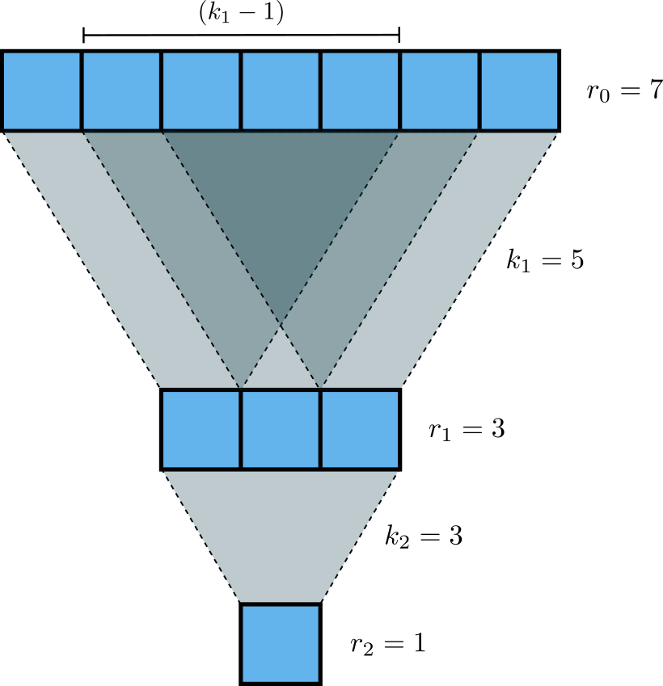

# Editorial for Intra-IUT Junior Programming Contest 2025

<details>
<summary>Problem A - Arcane Accumulation</summary>

Problem Setter: [Jannatul Fardus Rakhi](https://codeforces.com/profile/sectumsemprra)

Difficulty: Medium  
Tags: Greedy

<details>
<summary>Hint</summary>

What would be the optimal strategy for $k = 1$?

</details>

<details>
<summary>Solution</summary>

Let’s begin by understanding what happens when the **Cloning Spell** is used **once**.

When the _i-th_ wizard casts the spell:

- All _original_ wizards from position $1$ to $i - 1$ are cloned.
- These clones are inserted immediately before wizard $i$.
- The rest shift right accordingly.
- The cloned segment adds $sum(a[0] to a[i - 2])$ to the total magical potential.

Let’s call this value $prefix[i - 1]$ (the sum of the first $i - 1$ elements).  
So the **gain** from this spell is $prefix[i - 1]$.

Thus, if you’re allowed to cast the spell **once**, the optimal wizard is the one that gives the **maximum** $prefix[i - 1]$.

Now observe:

- Cloned wizards can’t be cloned again.
- So after the first application, further spells don’t introduce new content — they just clone the same **original** segment again.
- The cloned block remains identical every time.

This means:

- The **best wizard to clone once** is also the best wizard to clone multiple times.
- Each additional spell adds the same fixed value $prefix[i - 1]$.

Therefore, to maximize the total potential:

1. Choose the $i$ that maximizes $prefix[i - 1]$.
2. Add $k × prefix[i - 1]$ to the original sum of the array.

<summary>Code</summary>

```cpp
#include <bits/stdc++.h>
using namespace std;
#define ll long long


int main() {

          ios::sync_with_stdio(0);
          cin.tie(0);

          ll t=1,i,j;
          cin >> t;
         while(t--)
               {
                 ll n,k,sum = 0;
                 cin >> n >> k;
                 vector <ll> v(n);

                 for(i=0;i<n;i++){
                    cin >> v[i];
                    sum+= v[i];
                 }

                 vector <ll> pre(n,0);
                 pre[0] = v[0];

                 for (i=1;i<n;i++){
                    pre[i] = pre[i-1] + v[i];
                 }
                 ll mx_net_gain = 0;

                 for (i=0;i<n;i++){
                    mx_net_gain = max(mx_net_gain,pre[i]-v[i]);
                 }

                 ll ans = k*(mx_net_gain) + sum ;

                 cout << ans << endl;
               }

    return 0;
}
```

</details>
</details>
</details>

<details>
<summary>Problem B - Balloon</summary>

Problem Setter: [Reaz Hassan Joarder](https://codeforces.com/profile/ssshanto)

Difficulty: Giveaway

<details>
<summary>Hint</summary>

This problem has no input.\
_This is a trivial white lie._

</details>

<details>
<summary>Solution</summary>

You can implement the decryption algorithm. But since the answer is fixed, it is easier to decrypt it by yourself using a pen and paper. Then, simply print the decrypted string.

<details>
<summary>Code</summary>

```cpp
#include <bits/stdc++.h>
using namespace std;

int main()
{
    cout << "GIVE ME A BALLOON";
}
```

</details>
</details>
<details>
<summary>Alternate Solution</summary>

Let's go through this _tough_ problem step-by-step. The encrypted string that you are given is `NILE LE A BAMVOOG`. Keeping the spaces and vowels in their original positions, and masking out the consonants yields a skeleton of the form `⬚I⬚E ⬚E A ⬚A⬚⬚OO⬚`. Here, the original sequence of the filtered consonants is `[N, L, L, B, M, V, G]`, which upon being inverted, as per the encryption scheme, becomes `[G, V, M, B, L, L, N]`. Now, fill in the blank boxes of the skeleton string with the consonants in the order that they appear in the inverted sequence, and—voilà!—you obtain the answer `GIVE ME A BALLOON`.

<details>
<summary>Code</summary>

```cpp
#include <bits/stdc++.h>
using namespace std;

#define Godspeed                ios_base::sync_with_stdio(0);cin.tie(NULL)
#define urs(r...)               typename decay<decltype(r)>::type
#define REP(i,b)                for(urs(b) i=0;i<b;i++)
#define SPRESENT(c,x)           ((c).find(x) != string::npos)
#define Bye                     return 0

int main()
{
    Godspeed;
    int Tests=1;
//    cin>>Tests;
    while(Tests--)
    {
        string s="NILE LE A BAMVOOG",sC="",res="";
        string vowels="AEIOU";
        REP(i,s.length())
        {
            if(!SPRESENT(vowels,s[i]) && s[i]!=' ')
            {
               sC+=s[i];
            }
        }
        REP(i,s.length())
        {
            if(s[i]==' ')
            {
                res+=' ';
            }
            else if(SPRESENT(vowels,s[i]))
            {
                res+=s[i];
            }
            else
            {
                res+=sC.back();
                sC.pop_back();
            }
        }
        cout<<res;
    }
    Bye;
}
```

</details>
</details>
</details>

<details>
<summary>Problem C - You Can't See Me</summary>

Problem Setter: [Sabbir Ahmed](https://cse.iutoic-dhaka.edu/profile/sabbir/)

Difficulty: Easy

Tags: Math

<details>
<summary>Hint 1</summary>

What happens with a single convolution layer? If you apply a kernel of size $k$ to an image, how many input pixels does a single output pixel depend on?

</details>
<details>
<summary>Hint 2</summary>
How does the receptive field grow with each layer?
If you stack two convolution layers, each with kernel size $k_1$ and $k_2$, how does the receptive field of the output pixel relate to the previous layer?

</details>
<details>
<summary>Hint 3</summary>
Can you find a pattern or a recurrence relationship?

</details>
<details>
<summary>Solution</summary>

To determine the receptive field size, consider the kernel as a square grid of side length $k$. When a kernel slides over an image, the pixel at the top-right of the kernel is $(k - 1)$ pixels to the right of the pixel at the top-left. So the **width** (or side length) of the receptive field increases by $(k - 1)$ at each layer.

If the network has $n$ layers with kernel sizes $k_1, k_2, \dots, k_n$, the total span from the top-left to the top-right corner of the receptive field is:

$$
\sum_{i=1}^{n}(k_i - 1)
$$

Since the field is square and includes the initial pixel, we must add $1$ to get the final side length:

$$
\text{Receptive Field Length} = \sum_{i=1}^{n}(k_i - 1) + 1
$$

<details>
<summary>Code</summary>

```cpp
#include <bits/stdc++.h>
using namespace std;

#define fastio ios_base::sync_with_stdio(0); cin.tie(0)

using LL = long long;


void pre()
{
    fastio;


}

void solve(int tc)
{
    int i, n;
    cin >> n;

    vector<int> k(n);
    for(auto &it: k) cin >> it;

    LL d = 0;
    for(i = 0; i < n; i++) d += k[i] - 1;

    cout << d + 1;
}

signed main()
{
    pre();

    int tc, tt = 1;
    cin >> tt;

    for(tc = 1; tc <= tt; tc++)
    {
        // cout << "Case " << tc << ": ";
        solve(tc);
        cout << endl;
    }

    return 0;
}
```

</details>
</details>
<details>
<summary>Alternate Solution</summary>

Our objective is to determine the size of the receptive field at the input layer, (let's denote this as $r_0$). How should we approach this? If we carefully examine the illustration given in the problem statement, we can observe a hierarchical or _"pyramidal"_ relationship between the receptive field sizes of successive layers. Specifically, each layer’s receptive field is built upon the receptive field of the previous layer, expanding outward as we move closer to the input. This pattern can be leveraged to express the receptive field at any layer in terms of the layers above it, ultimately leading us to a general formula for $r_0$.\
We already know that the receptive field at the final layer, $r_n$, is always $1$, since each output feature depends only on itself. The key, then, is to find a general way to express $r_{i-1}$ in terms of $r_i$ for each layer.\
To make the problem even more approachable, let's visualize our neural network as a sequence of 1-dimensional convolutional layers. This simplification is valid because convolutional kernels are usually symmetric across their dimensions. Even in cases with asymmetric kernels, the same reasoning can be applied independently to each dimension. With that in mind, let’s consider a straightforward 1D convolutional neural network:


If we look at the relationship between Layer 2 and Layer 1 it is pretty easy to observe why the receptive field size is 3. A kernel with size $k_2=3$ is applied once. But when we go from Layer 1 to Layer 0 things start to get a bit more complicated. The observation here is that there is an overlap of $(k_1 - 1)$ pixels for each convolution operation on Layer 0 using the kernel $k_1=5$. So the resultant receptive field would become $r_0 = (k_1-1)+r_1$. Without the loss of generality, we can therefore claim that for consective layers $i-1$ and $i$,
$$ r\_{i-1} = k_i - 1 + r_i $$
Let’s unroll the recurrence relation backward for clarity. Starting from the final layer ($r_n = 1$):

$$
r_{n-1} = r_n + (k_n - 1) = 1 + (k_n - 1) = k_n\\
\Rightarrow r_{n-2} - k_{n-1} + 1 = k_n\\
\Rightarrow r_{n-2} = k_{n} + k_{n-1} - 1\\
\Rightarrow r_{n-3} - k_{n-2} + 1 = k_{n} + k_{n-1} - 1\\
\Rightarrow r_{n-3} = k_{n} + k_{n-1} + k_{n-2} - 2\\
\vdots\\\vdots\\
r_0 = \sum_{i=1}^n k_i - (n - 1) = \sum_{i=1}^n k_i - n + 1
$$

Thus, we obtain $r_0$, which is the receptive field at Layer 0.

<details>
<summary>Code</summary>

```cpp
#include <bits/stdc++.h>
using namespace std;

#define Godspeed                ios_base::sync_with_stdio(0);cin.tie(NULL)
#define urs(r...)               typename decay<decltype(r)>::type
#define REP(i,b)                for(urs(b) i=0;i<b;i++)
#define all(a)                  a.begin(),a.end()
#define Bye                     return 0
#define ll                      long long

int main()
{
    Godspeed;
    int Tests=1;
    cin>>Tests;
    while(Tests--)
    {
        ll n;
        cin>>n;
        vector<ll>k(n);
        REP(i,n)
        {
            cin>>k[i];
        }
        cout<<accumulate(all(k),0LL)-n+1<<endl;
    }
    Bye;
}
```

</details>
</details>
</details>

<details>
<summary>Problem D - Arise</summary>

Problem Setter: [Akib Haider](https://codeforces.com/profile/_akibhaider_)

Difficulty: Medium

Tags: Brute Force, Implementation, Strings

<details>
<summary>Hint</summary>

Read the input constraints carefully.

</details>

<details>
<summary>Solution</summary>

This problem can be solved using a brute-force approach.

The main task is to check whether a given string (a soldier’s name) appears in a straight line in a 2D grid. Since the grid size is small (the total number of characters is at most 1000 across all test cases), it is efficient enough to simply check **every possible starting position** in the grid and try to match the string in **each of the 8 directions** (horizontal, vertical, and both diagonals).

For each name:

- Start at every position in the grid.
- For each direction from the 8 possible directions, try to match each character in the string.
- If the full string matches without going out of bounds, count it.

While the algorithm is simple, the code can become very large unless written in a clean way. The implementation can be made much cleaner and more manageable by using **functions**.

In programming, repeating the same block of code in multiple places is considered bad practice. When a piece of logic is **reusable**, it is often a good idea to put it in a function. This improves readability, reduces the chance of errors, and makes debugging and testing easier.

<details>
<summary>Code</summary>

```cpp
#include <bits/stdc++.h>
using namespace std;

#define fastio ios_base::sync_with_stdio(0); cin.tie(0)
using LL = long long;

bool foundInLine(vector<string>& grid, string& str, int sx, int sy, int dx, int dy)
{
    int k, l = str.size(), n = grid.size(), m = grid[0].size();
    int x, y, kx, ky;

    for(k = 0; k < l; k++)
    {
        kx = k * dx;
        ky = k * dy;

        x = sx + kx;
        y = sy + ky;

        if(x < 0) return 0;
        if(y < 0) return 0;

        if(x >= n) return 0;
        if(y >= m) return 0;

        if(grid[x][y] != str[k]) return 0;
    }

    return 1;
}

bool foundInGrid(vector<string>& grid, string& str)
{
    int i, j, n = grid.size(), m = grid[0].size();

    for(i = 0; i < n; i++)
    {
        for(j = 0; j < m; j++)
        {
            if(foundInLine(grid, str, i, j, 1, 0)) return 1;
            if(foundInLine(grid, str, i, j, -1, 0)) return 1;
            if(foundInLine(grid, str, i, j, 0, 1)) return 1;
            if(foundInLine(grid, str, i, j, 0, -1)) return 1;
            if(foundInLine(grid, str, i, j, 1, 1)) return 1;
            if(foundInLine(grid, str, i, j, 1, -1)) return 1;
            if(foundInLine(grid, str, i, j, -1, 1)) return 1;
            if(foundInLine(grid, str, i, j, -1, -1)) return 1;
        }
    }

    return 0;
}


void pre()
{
    fastio;


}

void solve(int tc)
{
    int n, m;
    cin >> n >> m;

    vector<string> grid(n);
    for(auto &row: grid) cin >> row;

    int f, cnt = 0;
    string str;
    cin >> f;

    while(f--)
    {
        cin >> str;
        cnt += foundInGrid(grid, str);
    }

    cout << cnt;
}

int main()
{
    pre();

    int tc, tt = 1;
    cin >> tt;

    for(tc = 1; tc <= tt; tc++)
    {
        solve(tc);
        cout << '\n';
    }

    return 0;
}
```

</details>
</details>

<details>
<summary>Alternate Solution</summary>

Instead of manually scanning the grid in 8 directions for every string, you can flatten the grid into a single _text_ string that contains all the lines — rows, columns, diagonals — separated by delimiters (e.g., commas, underscores, or dollar signs) that are guaranteed not to occur in the grid.

Steps:

- Build one string that contains:
  - All rows (left-to-right)
  - All columns (top-to-bottom)
  - All diagonals (top-left to bottom-right and top-right to bottom-left)
- Reverse the entire string to handle all 8 directions.
- For each soldier name, check whether it appears as a substring in the flattened text.

<details>
<summary>Code</summary>

```cpp
#include <bits/stdc++.h>
using namespace std;

#define fastio ios_base::sync_with_stdio(0); cin.tie(0)
using LL = long long;

void gridToText(vector<string>& grid, string& text)
{
    int i, j, k, n = grid.size(), m = grid[0].size();
    char sep = ' ';

    // Left to Right
    for(i = 0; i < n; i++)
    {
        for(j = 0; j < m; j++)
        {
            text.push_back(grid[i][j]);
        }

        text.push_back(sep);
    }

    // Top to Bottom
    for(j = 0; j < m; j++)
    {
        for(i = 0; i < n; i++)
        {
            text.push_back(grid[i][j]);
        }

        text.push_back(sep);
    }

    // Top-Left to Bottom-Right
    for(i = 0; i < n; i++)
    {
        for(k = 0; i + k < n && k < m; k++)
        {
            text.push_back(grid[i + k][k]);
        }

        text.push_back(sep);
    }
    for(j = 1; j < m; j++)
    {
        for(k = 0; k < n && j + k < m; k++)
        {
            text.push_back(grid[k][j + k]);
        }

        text.push_back(sep);
    }

    // Bottom-Left to Top-Right
    for(i = 0; i < n; i++)
    {
        for(k = 0; i - k >= 0 && k < m; k++)
        {
            text.push_back(grid[i - k][k]);
        }

        text.push_back(sep);
    }
    for(j = 1; j < m; j++)
    {
        for(k = 0; k < n && j + k < m; k++)
        {
            text.push_back(grid[n - 1 - k][j + k]);
        }

        text.push_back(sep);
    }

    string rev = text;
    rev.pop_back(); // remove last sep
    reverse(rev.begin(), rev.end());
    text = text + rev;
}

bool foundInText(string& text, string& pattern)
{
    int i, j, n = text.size(), m = pattern.size();
    string window;

    for(i = 0; i < n; i++)
    {
        window = text.substr(i, m);
        if(window == pattern) return 1;
    }

    return 0;
}


void pre()
{
    fastio;


}

void solve(int tc)
{
    int n, m;
    cin >> n >> m;

    vector<string> grid(n);
    for(auto &row: grid) cin >> row;

    string text, soldier;
    gridToText(grid, text);

    // Check out how the text looks
    // cout << text << '\n';

    int i, q, cnt = 0;
    cin >> q;

    for(i = 0; i < q; i++)
    {
        cin >> soldier;
        cnt += foundInText(text, soldier);
    }

    cout << cnt;
}

int main()
{
    pre();

    int tc, tt = 1;
    cin >> tt;

    for(tc = 1; tc <= tt; tc++)
    {
        solve(tc);
        cout << '\n';
    }

    return 0;
}
```

</details>
</details>
</details>

<details>
<summary>Problem E - Eid Salami</summary>

Problem Setter: [Rafio](https://codeforces.com/profile/Rafio)

Difficulty: Hard

Tags: Greedy, Binary Search

<details>
<summary>Hint 1</summary>

First, focus on finding an optimal visiting order. Once you have that, calculating the minimum loan is easy.

</details>

<details>
<summary>Hint 2</summary>

Check out the sample test cases. For every cases, find the order of visiting houses and try to understand what is going on.

</details>

<details>
<summary>Hint 3</summary>

When a system has too many moving parts, you should first try to isolate their effects.  
For this problem, analyze special cases like:

- Zunaid has to give the same amount in every house.
- Zunaid will receive the same amount in every house.
- The delta (receive - give) is the same for all houses.

</details>

<details>
<summary>Hint 4</summary>

If Zunaid took loans whenever needed instead of a single large loan at the beginning, the total amount borrowed would remain the same.

</details>

<details>
<summary>Hint 5</summary>

It is always optimal to visit _delta-positive_ houses before _delta-negative_ houses.

</details>

<details>
<summary>Hint 6</summary>

What to do if all the houses are _delta-positive_ or all the houses are _delta-negative_?

</details>

<details>
<summary>Solution</summary>

At first, let's define some terms formally:

- For the $i$-th house, $\delta_i = r_i - g_i$
- A house is _delta-positive_ if $\delta_i > 0$
- A house is _delta-negative_ if $\delta_i < 0$

---

The first key insight is that there is _no reason whatsoever_ to visit a delta-negative house before a delta-positive one. Every house must be visited eventually. So, if Zunaid visits a delta-negative house early, he reduces his balance. This is never good.  
Visiting a delta-positive house afterward will still require him to give $g_i$ before receiving anything, which means the earlier balance reduction may force him to borrow more. The opposite order — visiting delta-positive houses first — helps increase the balance before visiting any other house.

So, all delta-positive houses should be visited before any delta-negative house.

---

Now, among the delta-positive houses, the goal is to make sure Zunaid can visit them with the smallest possible initial loan. Even though all these houses are profitable in the long run, Zunaid still has to give $g_i$ before he gets $r_i$. Therefore, among these, it makes sense to visit the houses that require the _least_ upfront money first. That way, Zunaid starts with visits that are cheap but profitable, which gradually builds up his balance. Then, when he reaches a house where he has to give a large $g_i$, his previous profit may already be enough to cover it, saving him from taking a large loan.

Hence, the delta-positive houses should be visited in _ascending_ order of $g_i$.

---

The ordering among delta-negative houses is less obvious. But it turns out that the way you order them can make a significant difference in how deep the balance goes below zero — and therefore how much Zunaid has to borrow.

Here are some observations:

- All delta-negative houses _must_ be visited eventually. None of them can be avoided and each will reduce the balance.
- If the receiving amount is the same for all delta-negative houses, the order doesn't matter.
- The money received from the _last_ house doesn't help at all.
- Similarly, the money received from the _second last_ house can only help in the last house.
- So, if there is a house from where Zunaid can receive a large amount of money, Zunaid should visit it early so that he can use that money. Even if Zunaid has to give a large amount to that house first, delaying it doesn't help at all. In fact, visiting other delta-negative houses will reduce his balance and make the situation worse.

Therefore, among delta-negative houses, it's best to visit first the ones where Zunaid receives more money. This gives him some balance to work with before facing the next loss.

So, delta-negative houses should be visited in _descending_ order of $r_i$.

---

Once the visiting order is fixed using the above rules, simulate the journey:

- Start with a balance of zero.
- At each house:
  - Subtract $g_i$ from the balance.
  - If the balance becomes negative, track how far below zero it goes — this represents how much loan Zunaid would have needed at the start.
  - Then add $r_i$ to the balance.
- The minimum required loan is the _maximum magnitude of the negative balance_ at any point during the simulation.

This method gives you the answer directly. Alternatively, you could design a function that checks whether a loan of $x$ is sufficient and binary search for the smallest such $x$.

---

**Summary of Strategy**:

1. Split the houses into delta-positive and delta-negative. Houses with $\delta_i = 0$ can be considered either delta-positive or delta-negative, but not both.
2. Sort:
   - Delta-positive houses by increasing $g_i$.
   - Delta-negative houses by decreasing $r_i$.
3. Visit all delta-positive houses first, then all delta-negative houses.
4. Simulate the journey and find the minimum required loan.

<details>
<summary>Proof</summary>

The correctness of the strategy can be proven in three steps.

---

Before proving any of the steps, let's establish the premise of the argument.

Suppose there are two houses:

- $(g_1, r_1)$ with $\delta_1 = r_1 - g_1$
- $(g_2, r_2)$ with $\delta_2 = r_2 - g_2$

Two visiting orders can be considered.

_Option 1:_ Visit $(g_1, r_1)$ before $(g_2, r_2)$  
Balance timeline: $[x, x - g_1, x + \delta_1, x + \delta_1 - g_2, x + \delta_1 + \delta_2]$  
Minimum balance: $\min(x - g_1, x + \delta_1 - g_2)$

_Option 2:_ Visit $(g_2, r_2)$ before $(g_1, r_1)$  
Balance timeline: $[x, x - g_2, x + \delta_2, x + \delta_2 - g_1, x + \delta_1 + \delta_2]$  
Minimum balance: $\min(x - g_2, x + \delta_2 - g_1)$

**The optimal choice is the one that maximizes the minimum balance.**

---

_Step 1: Delta-positive houses must be visited before delta-negative houses._

Assume $\delta_1 > 0$ and $\delta_2 < 0$.

Now,

- $x + \delta_2 - g_1 < x - g_1$ $[\because \delta_2 < 0]$
- $x - g_2 < x + \delta_1 - g_2$ $[\because \delta_1 > 0]$

Clearly, both terms in Option 1 have a smaller counterparts in Option 2. Hence, the minimum balance in Option 2 is strictly smaller, meaning a higher loan would be required. Therefore, Option 1 is better.

---

_Step 2: Among delta-positive houses, those with smaller $g$ must be visited earlier._

Assume both $\delta_1, \delta_2 > 0$ and $g_1 > g_2$.

Now,

- $x - g_1 < x - g_2$ $[\because g_1 > g_2]$,
- $x - g_1 < x + d_2 - g_1$ $[\because \delta_2 > 0]$

Both terms in Option 2 have a smaller counterpart in Option 1. So, the minimum balance in Option 1 is smaller. Therefore, Option 2 is better.

---

_Step 3: Among delta-negative houses, those with larger $r$ must be visited earlier._

Assume both $\delta_1, \delta_2 < 0$ and $r_1 > r_2$.

Now,

- $x + \delta_2 - g_1 = x + \delta_1 + \delta_2 - r_1$
- $x + \delta_1 - g_2 = x + \delta_1 + \delta_2 - r_2$
- $x + \delta_2 - g_1 < x + \delta_1 - g_2$ $[\because r_1 > r_2]$
- $x + \delta_2 - g_1 < x - g_1$ $[\because \delta_2 < 0]$

Both terms in Option 1 have a smaller counterpart in Option 2. So, the minimum balance in Option 2 is smaller. Therefore, Option 1 is better.

</details>

<details>
<summary>Code</summary>

```cpp
#include <bits/stdc++.h>
using namespace std;

#define fastio ios_base::sync_with_stdio(0); cin.tie(0)

using LL = long long;

bool comp(pair<int,int> p1, pair<int,int> p2)
{
    auto [g1, r1] = p1; // g1 = p1.first; r1 = p1.second;
    auto [g2, r2] = p2;

    int delta1 = r1 - g1, delta2 = r2 - g2;

    if(delta1 > 0 && delta2 > 0) return g1 < g2; // Sort delta-positive houses by ascending order of giving amount
    if(delta1 <= 0 && delta2 <= 0) return r1 > r2; // Sort delta-negative houses by descending order of receiving amount
    return delta1 > delta2; // Visit delta-positive houses before delta-negative houses
}

bool enough(vector<pair<int,int>>& v, LL loan)
{
    int give, receive;
    LL balance = loan;

    for(auto it: v)
    {
        give = it.first;
        receive = it.second;

        balance -= give;

        if(balance < 0) return 0;

        balance += receive;
    }

    return 1;
}


void pre()
{
    fastio;


}

void solve(int tc)
{
    int i, n;
    cin >> n;

    vector<pair<int,int>> v(n);
    for(auto &it: v) cin >> it.first; // for(i = 0; i < n; i++) cin >> v[i].first;
    for(auto &it: v) cin >> it.second;

    sort(v.begin(), v.end(), comp);

    LL lo = 0, hi = 2e14, mid;
    while(lo <= hi)
    {
        mid = (lo + hi) / 2;

        if(enough(v, mid)) hi = mid - 1;
        else lo = mid + 1;
    }

    cout << lo;
}

signed main()
{
    pre();

    int tc, tt = 1;
    cin >> tt;

    for(tc = 1; tc <= tt; tc++)
    {
        // cout << "Case " << tc << ": ";
        solve(tc);
        cout << endl;
    }

    return 0;
}
```

</details>

<details>
<summary>Code</summary>

```cpp
#include <bits/stdc++.h>
using namespace std;

#define fastio ios_base::sync_with_stdio(0); cin.tie(0)

using LL = long long;

bool comp(pair<int,int> p1, pair<int,int> p2)
{
    auto [g1, r1] = p1;
    auto [g2, r2] = p2;

    int delta1 = r1 - g1, delta2 = r2 - g2;

    if(delta1 > 0 && delta2 > 0) return g1 < g2;
    if(delta1 <= 0 && delta2 <= 0) return r1 > r2;
    return delta1 > delta2;
}


void pre()
{
    fastio;


}

void solve(int tc)
{
    int i, n;
    cin >> n;

    vector<pair<int,int>> v(n);
    for(auto &it: v) cin >> it.first;
    for(auto &it: v) cin >> it.second;
    sort(v.begin(), v.end(), comp);

    LL balance = 0, ans = 0;

    for(auto [give, receive]: v)
    {
        balance -= give;
        ans = max(ans, -balance);
        balance += receive;
    }

    cout << ans;
}

signed main()
{
    pre();

    int tc, tt = 1;
    cin >> tt;

    for(tc = 1; tc <= tt; tc++)
    {
        // cout << "Case " << tc << ": ";
        solve(tc);
        cout << endl;
    }

    return 0;
}
```

</details>

</details>
</details>
</details>

<details>
<summary>Problem F - Inverted Query</summary>

Problem Setter: [Mahiul Kabir](https://codeforces.com/profile/the-NerdNinja)

Difficulty: Easy-Medium

Tags: Range Query

<details>
<summary><strong>Hint 0</strong> : How can you find the maximum absolute difference of 2 elements of any set?</summary>
  <p>The maximum difference can be found by taking the <code>max(S)</code> and <code>min(S)</code> elements from the set.</p>
  <p><strong>Why?</strong> Because if the elements are <code>x, y</code> with <code>x &lt; y</code>, choosing a smaller <code>x'</code> would only increase <code>y − x'</code>, so the extreme values give the maximum.</p>

</details>

<details>
  <summary><strong>Hint 1</strong> : What are we left with when we remove range [l, r] from the array?</summary>
  <p>We have some <strong>prefix</strong> of the array and some <strong>suffix</strong>.</p>
</details>

<details>
  <summary><strong>Solution</strong></summary>
  <p>The brute-force approach is too slow. From the hints, we see that after removing <code>[l, r]</code> we only need:</p>
  <ul>
    <li>the minimum and maximum of the prefix <code>A[1 … l−1]</code></li>
    <li>the minimum and maximum of the suffix <code>A[r+1 … n]</code></li>
  </ul>
  <p>Precompute four arrays in O(n) time:</p>
  <ul>
    <li><code>pref_Min[i]</code> = min of <code>A[1 … i]</code></li>
    <li><code>pref_Max[i]</code> = max of <code>A[1 … i]</code></li>
    <li><code>suf_Min[i]</code> = min of <code>A[i … n]</code></li>
    <li><code>suf_Max[i]</code> = max of <code>A[i … n]</code></li>
  </ul>
  <p>Then for any query <code>(l, r)</code>, we can combine the corresponding prefix and suffix minimums and maximums as follows, in O(1):</p>
  <pre><code>minVal   = min(pref_Min[l-1], suf_Min[r+1])
maxVal   = max(pref_Max[l-1], suf_Max[r+1])
max_diff = maxVal - minVal
  </code></pre>
  And output their difference as our answer.
</details>

<details>
<summary><strong>Code</strong></summary>

```cpp
#include <bits/stdc++.h>
using namespace std;

void solve() {
    int n, q;
    cin >> n >> q;
    vector<int> A(n+2);
    for (int i = 1; i <= n; i++)
        cin >> A[i];

    const int INF = 1e9 + 5;
    vector<int> pref_min(n+2, INF), pref_max(n+2, -INF);
    vector<int> suff_min(n+2, INF), suff_max(n+2, -INF);

    // Build prefix
    for (int i = 1; i <= n; i++) {
        pref_min[i] = min(pref_min[i-1], A[i]);
        pref_max[i] = max(pref_max[i-1], A[i]);
    }
    // Build suffix
    for (int i = n; i >= 1; i--) {
        suff_min[i] = min(suff_min[i+1], A[i]);
        suff_max[i] = max(suff_max[i+1], A[i]);
    }

    while (q--) {
        int l, r;
        cin >> l >> r;

        int outside_min = INF, outside_max = -INF;
        int outside_count = 0;

        // prefix part [1..l-1]
        if (l > 1) {
            outside_min = min(outside_min, pref_min[l-1]);
            outside_max = max(outside_max, pref_max[l-1]);
            outside_count += (l-1);
        }
        // suffix part [r+1..n]
        if (r < n) {
            outside_min = min(outside_min, suff_min[r+1]);
            outside_max = max(outside_max, suff_max[r+1]);
            outside_count += (n - r);
        }

        if (outside_count < 2) {
            cout << -1 << "\n";
        } else {
            cout << (outside_max - outside_min) << "\n";
        }
    }
}

int main(){
  int tc; cin >> tc;
  while(tc--) solve();
}

```

</details>

</details>
</details>
</details>

<details>
<summary>Problem G - Trouble in the North</summary>

Problem Setter: [Abdullah Abrar](https://codeforces.com/profile/lelbaba)

Difficulty: Easy

Tags: Math

<details>
<summary>Hint</summary>

Can you construct 4 simultaneous equations with which you can solve the 4 unknowns? A smart adoption of substitution and elimination should help us solve these equations.

</details>

<details>
<summary>Solution</summary>

Let's denote the actual influence values of Shabab, Hamim, Rafi, and Abdullah with $w$, $x$, $y$, and $z$ respectively. Therefore, the given inputs can be written as,

$$
a = \frac{x+y+z}{3} \Rightarrow 3a=x+y+z\\
b = \frac{w+y+z}{3} \Rightarrow 3b=w+y+z\\
c = \frac{w+x+z}{3} \Rightarrow 3c=w+x+z\\
d = \frac{w+x+y}{3} \Rightarrow 3d=w+x+y
$$

Summing these equations yield the following relationship:

$$
3a+3b+3c+3d=3w+3x+3y+3z\\
\Rightarrow 3\cdot(a+b+c+d)=3\cdot(w+x+y+z)\\
\Rightarrow a+b+c+d=w+x+y+z
$$

Now, let's denote the aggregate influence of all the 4 lords using $s=w+x+y+z$, which also means $s=a+b+c+d$. The aforementioned set of 4 equations can then be rewritten as,

$$
3a = s-w \Rightarrow w = s - 3a\\
3b = s-x \Rightarrow x = s - 3b\\
3c = s-y \Rightarrow y = s - 3c\\
3d = s-z \Rightarrow z = s - 3d
$$

Consequently, we end up inferring the clouts $w$, $x$, $y$, and $z$ of all 4 lords Shabab, Hamim, Rafi, and Abdullah respectively.

<details>
<summary>Code</summary>

```cpp
#include <bits/stdc++.h>
using namespace std;

#define fastio ios_base::sync_with_stdio(0); cin.tie(0)
using LL = long long;


void pre()
{
    fastio;


}

void solve(int tc)
{
    int a, b, c, d;
    cin >> a >> b >> c >> d;

    int sum = a + b + c + d;
    cout << sum - 3 * a << ' ' << sum - 3 * b << ' ' << sum - 3 * c << ' ' << sum - 3 * d;
}

signed main()
{
    pre();

    int tc, tt = 1;
    cin >> tt;

    for(tc = 1; tc <= tt; tc++)
    {
        // cout << "Case " << tc << ": ";
        solve(tc);
        cout << '\n';
    }

    return 0;
}
```

</details>
</details>
</details>

<details>
<summary>Problem H - Hex Game</summary>

Problem Setter: [Rafio](https://codeforces.com/profile/Rafio)

Difficulty: Medium

Tags: Geometry, Interactive, Game Theory

<details>
<summary>Hint 1</summary>

You can't control what your opponent will do. So try to come up with a _simple_ strategy where you'll have a response for _anything_ your opponent does.

</details>

<details>
<summary>Hint 2</summary>

Solve a simpler problem. Ignore the hexagon and assume you can place disks anywhere. Try to come up with a strategy for a square or a circular board and make modifications to transfer the strategy for the hexagon.

</details>

<details>
<summary>Solution</summary>

The board is a _regular_ hexagon, which means it must be symmetric about its center. So, every point inside it must have a reflection through the center. The only exception is the center itself, which is its own reflection.

With that information, you can develop a strategy like this:

- Place the first disk in the center $C(0, l)$.
- Then, for every move the opponent makes at $P(x, y)$, respond with its reflection through the center: $P'(x', y')$.

Now,  
Vector $\vec{CP} = P - C = (x, y) - (0, l) = (x, y - l)$  
So, reflected vector $\vec{CP'} = -\vec{CP} = (-x, l - y)$  
So, the reflection point $P' = C + \vec{CP'} = (-x, 2l - y)$

<details>
<summary>Proof</summary>

- $C(0, l)$ is a lattice point.
- Since $r \le l/2$, the first disk easily fits inside the board, so your first move is valid.
- After you make the first move, the board remains symmetric.
- The center is now occupied, so your opponent cannot touch it.
- Before your opponent makes any move, the board is symmetric. So, if any point $P(x, y)$ is within the hexagon and not overlapping with any disk, the same applies to its reflection $P'(-x, 2l - y)$.
- So, if your opponent makes a valid move at $P$, your move at $P'$ will also be valid.
- Each time you respond to your opponent's move by mirroring it, _the board becomes symmetric again._ So, the property holds and you will always have the guarantee that **whenever your opponent makes a valid move, you have a valid response to that**.
- Eventually, your opponent will be forced to make an invalid move and you win!

</details>

<details>
<summary>Code</summary>

```cpp
#include <bits/stdc++.h>
using namespace std;

#define fastio ios_base::sync_with_stdio(0); cin.tie(0)
using LL = long long;


void pre()
{
    // No fastio for interactive problems
    // fastio;


}

void solve(int tc)
{
    int l, r, x, y, status = 1;
    char ch;

    cin >> l >> r;
    x = 0, y = l;

    while(status != -1)
    {
        x = -x, y = 2 * l - y;
        cout << "P " << x << ' ' << y << endl;
        fflush(stdout);

        cin >> ch >> status;
        if(status == -1) exit(1);

        cin >> ch >> x >> y;
        cin >> ch >> status;
    }
}

signed main()
{
    pre();

    int tc, tt = 1;
    cin >> tt;

    for(tc = 1; tc <= tt; tc++)
    {
        solve(tc);
        cout << endl;
    }

    return 0;
}
```

</details>
</details>
</details>
